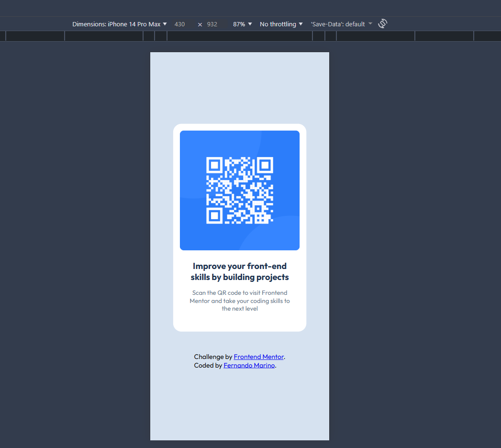
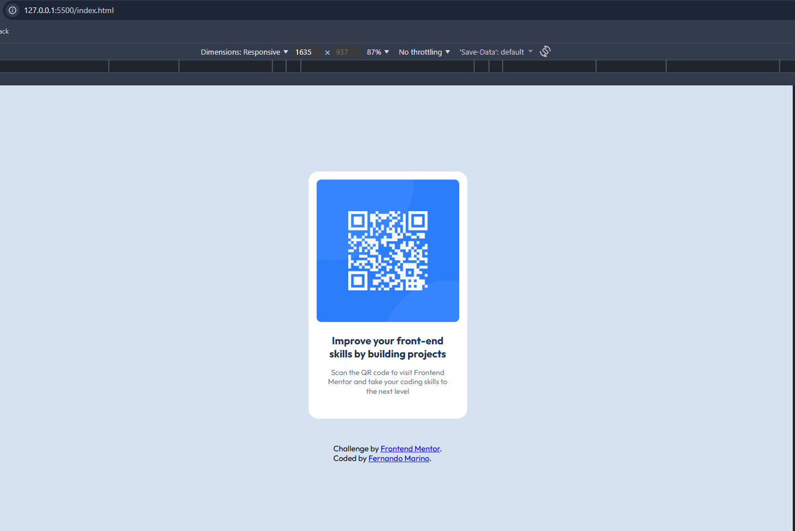

# Frontend Mentor - QR code component solution

This is a solution to the [QR code component challenge on Frontend Mentor](https://www.frontendmentor.io/challenges/qr-code-component-iux_sIO_H) implemented by Fernando Marino. 
Frontend Mentor challenges help you improve your coding skills by building realistic projects.

## Table of contents

- [Overview](#overview)
  - [Screenshot](#screenshot)
  - [Links](#links)
- [My process](#my-process)
  - [Built with](#built-with)
  - [What I learned](#what-i-learned)
  - [Continued development](#continued-development)
  - [Useful resources](#useful-resources)
- [Author](#author)

## Overview

### Screenshots

### Links

- Solution URL: [HTML & CSS Solution](https://github.com/FernandoMarino/frontend-mentor-challenge-1-qr-code-component)

## My process

### Built with

- Semantic HTML5 markup
  - Added main container
  - Added proper class name to each section
- CSS custom properties
  - Added styles based on each elements
- Flex
- Mobile-first workflow

### What I learned

This was my first full experience designing and implementing without 100% alone, without following any tutorial and just researching as needed. 

This project was a great opportunity the fully enbrance and start the journey as a FullStack Engineer.

Still need to practice more to design these kind of components faster and also to design it on my own.

### Continued development

 Implement the same component using different approaches, like full SPA using React or even using some framework like Next.js.

 A big area of improvement is learning hot to proper document my development process during the implementation and not let all the wording to the end as it may not be that fresh anymore and a few details got be missing. 

### Useful resources

- [The Markdown Guide](https://www.markdownguide.org/) - As suggested on the README-template, I have used as a reference to structurize this README and will certainly use as a documentatin guide for future projects.
- [Example resource 1](https://www.example.com) - This helped me for XYZ reason. I really liked this pattern and will use it going forward.
- [Example resource 2](https://www.example.com) - This is an amazing article which helped me finally understand XYZ. I'd recommend it to anyone still learning this concept.

**Note: Delete this note and replace the list above with resources that helped you during the challenge. These could come in handy for anyone viewing your solution or for yourself when you look back on this project in the future.**

## Author

- Frontend Mentor - [@FernandoMarino](https://www.frontendmentor.io/profile/FernandoMarino)

